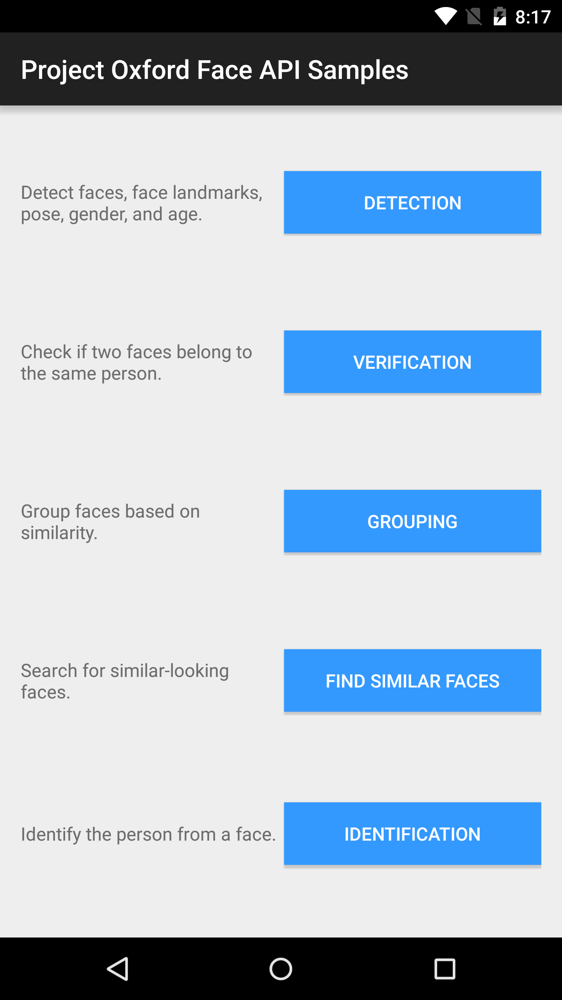
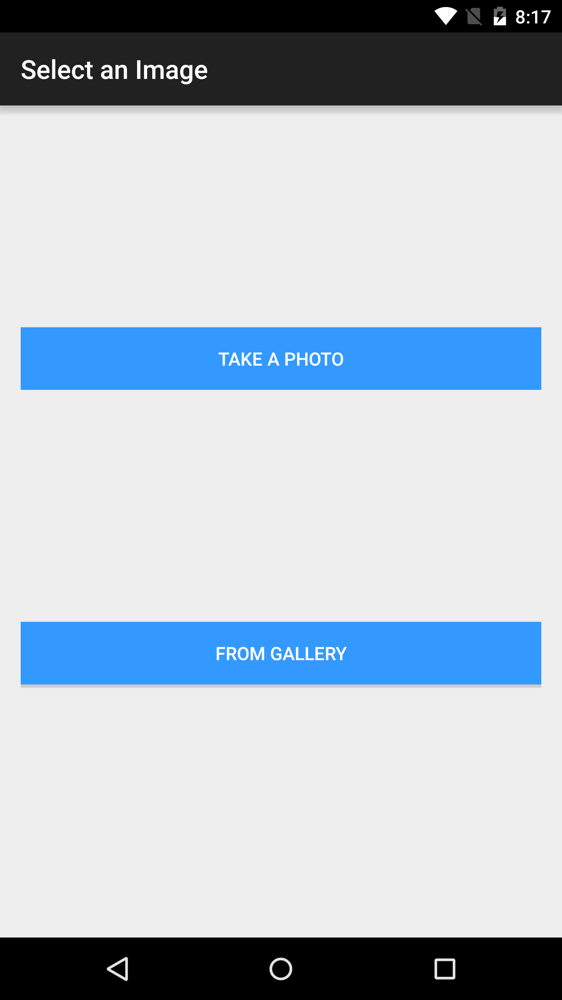

The client library
==================

The Face API client library is a thin Java client wrapper for Project Oxford
Face REST APIs.  

The easiest way to consume the client library is to add com.microsoft.projectoxford.face package from Maven Central Repository.

To find the latest version of client library, go to http://search.maven.org, and search for "com.microsoft.projectoxford".

To add the client library dependency from build.gradle file, add the following line in dependencies.

```
dependencies {
    //
    // Use the following line to include client library from Maven Central Repository
    // Change the version number from the search.maven.org result
    //
    compile 'com.microsoft.projectoxford:face:1.0.0'

    // Your other Dependencies...
}
```

To do add the client library dependency from Android Studio:
1. From Menu, Choose File \> Project Structure
2. Click on your app module
3. Click on Dependencies tab
4. Click "+" sign to add new dependency
5. Pick "Library dependency" from the drop down list
6. Type "com.microsoft.projectoxford" and hit the search icon from "Choose Library Dependency" dialog
7. Pick the Project Oxford client library that you intend to use.
8. Click "OK" to add the new dependency

The sample
==========

This sample is an Android application to demonstrate the use of Project Oxford
Face API.

It demonstrates face detection, face verification, face grouping, finding
similar faces, and face identification functionalities.

Requirements
------------

Android OS must be Android 4.1 or higher (API Level 16 or higher)

Build the sample
----------------

You will
need a [Microsoft Azure Account](<http://www.azure.com>) if you don't have one already.

1. You must obtain a subscription key for Face API by following instructions in [Subscription
key management](<http://www.projectoxford.ai/doc/general/subscription-key-mgmt>).

2.  Start Android Studio and open project from Face \> Android \> Sample folder.

3.  In Android Studio -\> "Project" panel -\> "Android" view, open file
    "app/res/values/strings.xml", and find the line
    "Please\_add\_the\_subscription\_key\_here;". Replace the
    "Please\_add\_the\_subscription\_key\_here" value with your subscription key
    string from the first step. If you cannot find the file "strings.xml", it is
    in folder "Sample\app\src\main\res\values\string.xml".

4.  In Android Studio, select menu "Build \> Make Project" to build the sample.

Run the sample
--------------

In Android Studio, select menu "Run", and "Run app" to launch this sample app.

Once the app is launched, click on buttons to use samples of between different
scenarios, and follow the instructions on screen.

Microsoft will receive the images you upload and may use them to improve Face
API and related services. By submitting an image, you confirm you have consent
from everyone in it.





Contributing
============
We welcome contributions and are always looking for new SDKs, input, and
suggestions. Feel free to file issues on the repo and we'll address them as we can. You can also learn more about how you can help on the [Contribution
Rules & Guidelines](</CONTRIBUTING.md>).

For questions, feedback, or suggestions about Project Oxford services, feel free to reach out to us directly.

-   [Project Oxford support](<mailto:oxfordSup@microsoft.com?subject=Project%20Oxford%20Support>)

-   [Forums](<https://social.msdn.microsoft.com/forums/azure/en-US/home?forum=mlapi>)

-   [Blog](<https://blogs.technet.com/b/machinelearning/archive/tags/project+oxford/default.aspx>)

License
=======

All Project Oxford SDKs and samples are licensed with the MIT License. For more details, see
[LICENSE](</LICENSE.md>).

Sample images are licensed separately, please refer to [LICENSE-IMAGE](</LICENSE-IMAGE.md>).
