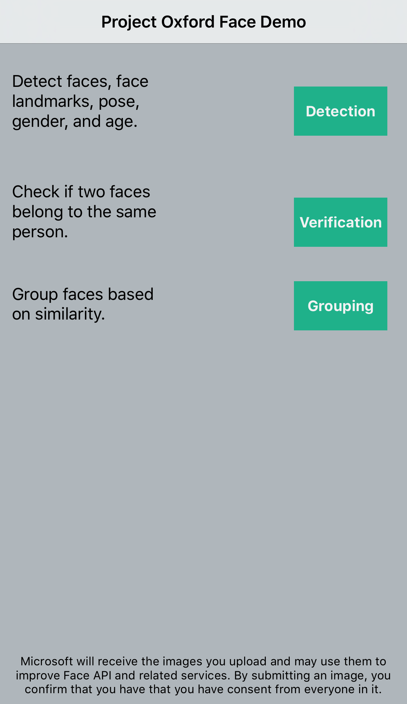
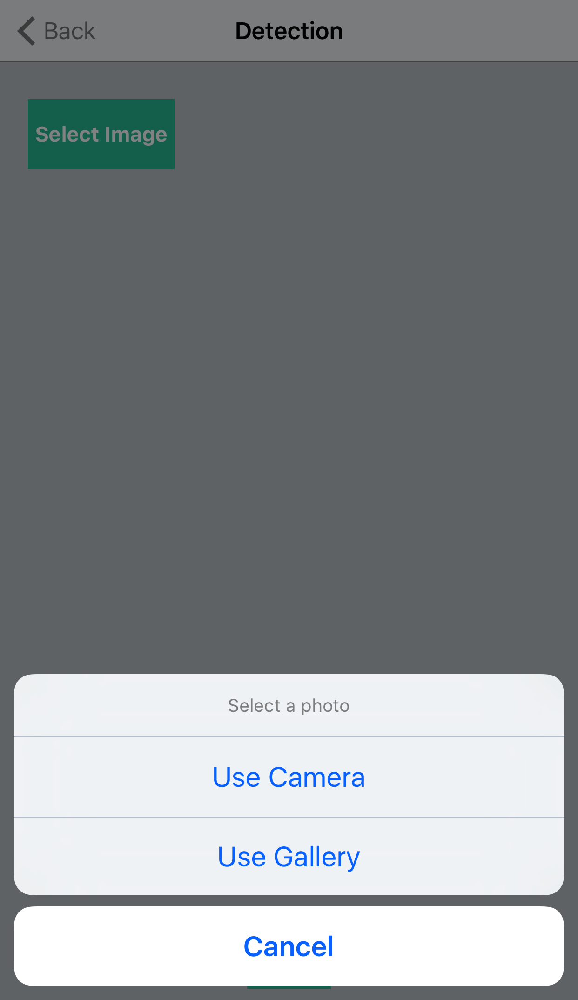
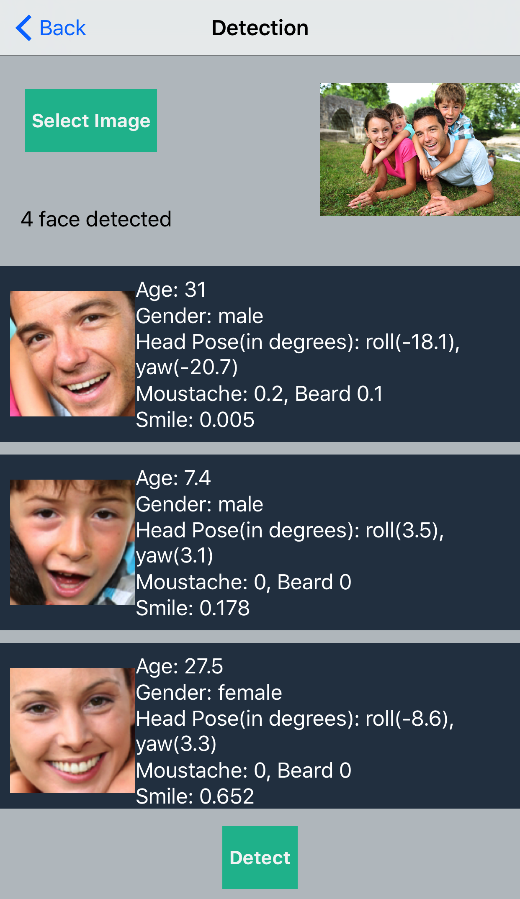
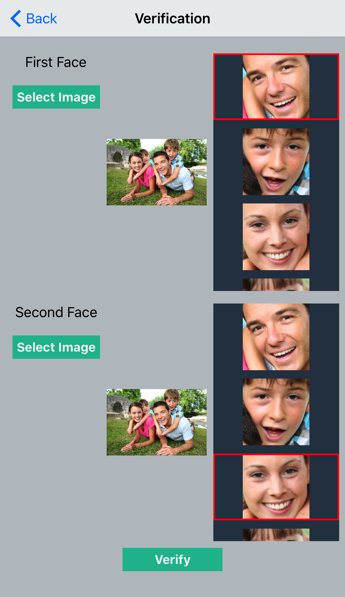

Microsoft Cognitive Services Face iOS SDK
==================

The iOS Face SDK allows you to use Microsoft Cognitive Services (formerly Microsoft Cognitive Services) Face REST APIs on the iOS platform.

Getting started
==========

The easiest way to consume the iOS client library is via CocoaPods.

### Install via Cocoapods
* [Install Cocoapods](http://guides.cocoapods.org/using/getting-started.html) - Follow the getting started guide to install Cocoapods.
* Add the following to your Podfile : `pod 'ProjectOxfordFace'`
* Run the command `pod install` to install the latest ProjectOxfordFace pod.
* Add `#import <ProjectOxfordFace/MPOFaceSDK.h>` to all files that need to reference the SDK.

Sample app
==========
The sample app demonstrate the use of Microsoft Cognitive Services (formerly Project Oxford) Face iOS SDK. The sample shows scenarios such as face detection, face verification, and face grouping.

Requirements
------------

iOS must be version 9.0 or higher.

Build the sample
----------------

1. First, you must obtain a Face API subscription key by following instructions in [Microsoft Cognitive Services subscription](<https://www.microsoft.com/cognitive-services/en-us/sign-up>).
2.  Clone the git repository, `git clone https://github.com/Microsoft/ProjectOxford-ClientSDK`
3. Run `pod install` from the Example directory to set up the CocoaPod. To do this first cd to `ProjectOxford-ClientSDK/Face/iOS/Example` and then run `pod install`
4. Open `ProjectOxfordFace.xcworkspace` located at `ProjectOxford-ClientSDK/Face/iOS/Example` in Xcode

Run the sample
--------------

1. Once in Xcode, under the example subdirectory, navigate to the file `MPODemoConstants.h` and insert your subscription key for the Face API
2. To run the sample app, ensure that the target on top right side of Xcode is selected as `ProjectOxfordFace-Example` and select the play button or select Product > Run on the menu bar
3. Once the app is launched, click on the buttons to try out the different scenarios.

Microsoft will receive the images you upload and may use them to improve Face API and related services. By submitting an image, you confirm you have consent from everyone in it.

Running and exploring the unit tests
--------------

Unit tests that demonstrate various Microsoft Cognitive Services (formerly Project Oxford) scenarios such as detection, identification, grouping, similarity, verification, and face lists are located at `Face/iOS/Example/Tests`. To run the unit tests, first insert your subscription key in `MPOTestConstants.h` and then select the test navigator pane in Xcode to display all of the tests which can be run.

Contributing
============
We welcome contributions and are always looking for new SDKs, input, and
suggestions. Feel free to file issues on the repo and we'll address them as we can. You can also learn more about how you can help on the [Contribution
Rules & Guidelines](</CONTRIBUTING.md>).

For questions, feedback, or suggestions about Microsoft Cognitive Services, feel free to reach out to us directly.

-   [Cognitive Services UserVoice Forum](<https://cognitive.uservoice.com>)

License
=======

All Microsoft Cognitive Services SDKs and samples are licensed with the MIT License. For more details, see
[LICENSE](</LICENSE.md>).

Sample images are licensed separately, please refer to [LICENSE-IMAGE](</LICENSE-IMAGE.md>).
