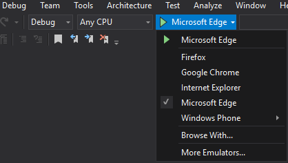
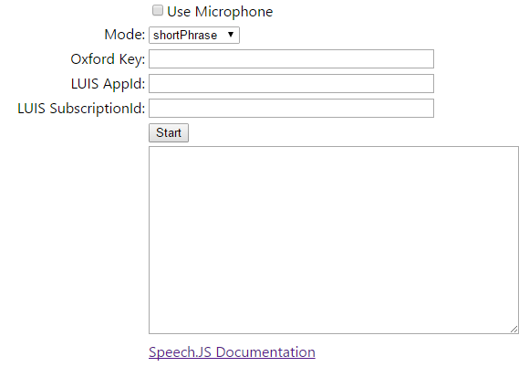

Oxford.Speech.JS
==================

Oxford.Speech.JS is a sample for Microsoft Cognitive Services (formerly Project Oxford)
Speech To Text APIs using Javascript.  

To use Speech.JS, simply host Speech.1.0.0.js on your website.  A 'minified' version of Speech.JS is also available Speech.1.0.0.min.js.

The Speech Recognition Web Sample
==========

This sample is web application to demonstrate the use of Microsoft Cognitive Services (formerly Project Oxford)
Speech To Text API using Javascript.

It demonstrates the following features using a wav file or external microphone input:

* Short-form recognition.
* Long-form dictation.
* Recognition with intent.

Build the sample
----------------

1.  First, you must obtain a Speech API subscription key by following instructions in [Microsoft Cognitive Services subscription](<https://www.microsoft.com/cognitive-services/en-us/sign-up>).

2.  Start Visual Studio and choose the menu "File", "Open", "Project/Solution" the workspace file Speech \> Speech.JS \> Oxford.Speech.JS.sln.

3.  In Visual Studio , select menu "Build\> Build Solution" to build the sample.

4.  Choose the target browser you would like to use.

5. "Debug" to launch the sample app.

Running the sample
--------------

1.  In the web application, enter your Microsoft Cognitive Services (formerly Project Oxford) Speech subscription key under "Oxford Key".

2. Select whether you would like to use the Microphone and what speech mode you would like to use by select "Use Microphone" and the "Mode" drop down box.

3.  For modes where you would like both Speech recognition and Intent to work, you need to sign up [Language Understanding Intelligent Service (LUIS)](<https://www.microsoft.com/cognitive-services/en-us/sign-up>) and set the key values in the fields "Luis AppID" and "LUIS SubscriptionId".

3. To Start recognition, press the Start button.

Contributing
============
We welcome contributions and are always looking for new SDKs, input, and
suggestions. Feel free to file issues on the repo and we'll address them as we can. You can also learn more about how you can help on the [Contribution
Rules & Guidelines](</CONTRIBUTING.md>).

For questions, feedback, or suggestions about Microsoft Cognitive Services, feel free to reach out to us directly.

-   [Cognitive Services UserVoice Forum](<https://cognitive.uservoice.com>)

License
=======

All Microsoft Cognitive Services SDKs and samples are licensed with the MIT License. For more details, see
[LICENSE](</LICENSE.md>).

Sample images are licensed separately, please refer to [LICENSE-IMAGE](</LICENSE-IMAGE.md>).
