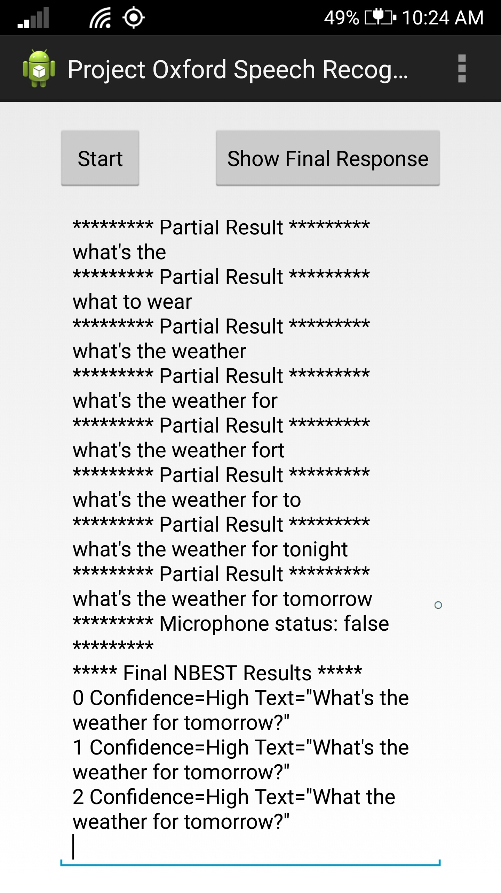

The client library
==================

The Speech To Text client library is a client library for Project Oxford
Speech To Text REST APIs.  

The easiest way to consume the client library is to add com.microsoft.projectoxford.face package from Maven Central Repository.

To find the latest version of client library, go to http://search.maven.org, and search for "com.microsoft.projectoxford".

To add the client library dependency from build.gradle file, add the following line in dependencies.

```
dependencies {
    //
    // Use the following line to include client library from Maven Central Repository
    // Change the version number from the search.maven.org result
    //
    compile 'com.microsoft.projectoxford:speechrecognition:0.5.0'

    // Your other Dependencies...
}
```

To do add the client library dependency from Android Studio:
1. From Menu, Choose File \> Project Structure
2. Click on your app module
3. Click on Dependencies tab
4. Click "+" sign to add new dependency
5. Pick "Library dependency" from the drop down list
6. Type "com.microsoft.projectoxford" and hit the search icon from "Choose Library Dependency" dialog
7. Pick the Project Oxford client library that you intend to use.
8. Click "OK" to add the new dependency

The sample
==========

This sample is an Android application to demonstrate the use of Project Oxford
Speech To Text API.

It demonstrates the following features using a wav file or external microphone input:

* Short-form recognition.
* Long-form dictation.
* Recognition with intent.

Requirements
------------

* Android OS must be Android 4.1 or higher (API Level 16 or higher)
* The speech client library contains native code. To use this sample in an emulator, make sure that your build variant matches the architecture (x86 or arm) of your emulator. However, due to the need of audio, using a physical device is recommended.

Build the sample
----------------

You will
need a [Microsoft Azure Account](<http://www.azure.com>) if you don't have one already.

1. You must obtain a subscription key for Face API by following instructions in [Subscription
key management](<http://www.projectoxford.ai/doc/general/subscription-key-mgmt>).

2.  Start Android Studio and open project from Speech \> TextToSpeech \> Android folder.

3.  In Android Studio -\> "Project" panel -\> "Android" view, open file
    "app/res/values/strings.xml", and find the line
    "Please\_add\_the\_subscription\_key\_here;". Replace the
    "Please\_add\_the\_subscription\_key\_here" value with your subscription key
    string from the first step. If you cannot find the file "strings.xml", it is
    in folder "Samples\_SpeechRecoExample\_res\_values\_strings.xml".

4.  In Android Studio, select menu "Build \> Make Project" to build the sample,
    and "Run" to launch this sample app.

5.  Change the flag values in OnCreate() method in MainActivity.java to try different
    scenarios.  

    To try recognize from microphone, set m_isMicrophoneReco to be true.
    To try recognize from data file, set m_isMicrophoneReco to be false.

    To try recognize short phrase, set m_recoMode to SpeechRecognitionMode.ShortPhrase.
    To try recognize long dictation, set m_recoMode to SpeechRecognitionMode.LongDictation.    

    To try recognize intent, set m_recoMode to SpeechRecognitionMode.ShortPhrase
    and set m_isIntent to be true.

    For intent recognition to work, you need to sign up [Language Understanding Intelligent Service (LUIS)](<https://www.projectoxford.ai/luis>) and set the key values in
    luisAppID and luisSubscriptionID from "Samples\_SpeechRecoExample\_res\_values\_strings.xml".



Run the sample
--------------

In Android Studio, select menu "Run", and "Run app" to launch this sample app.

Contributing
============

We welcome contributions and are always looking for new SDKs, input, and
suggestions. Learn more about how you can help by reading the [Contribution
Rules & Guidelines](</CONTRIBUTING.md>).

Additionally, feel free to reach out to us directly with questions, feedback, or
suggestions.

-   [Project Oxford
    support](<mailto:oxfordSignup@microsoft.com?subject=Project%20Oxford%20Sign%20Up>)

-   [Forums](<https://social.msdn.microsoft.com/forums/azure/en-US/home?forum=mlapi>)

-   [Blog](<https://blogs.technet.com/b/machinelearning/archive/tags/project+oxford/default.aspx>)

License
=======

All Project Oxford SDKs are licensed with the MIT License. For more details, see
[License](</LICENSE.md>).
