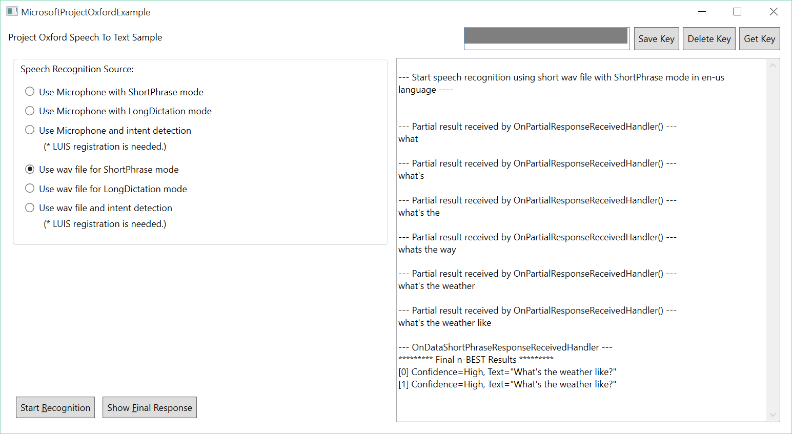

The client library
==================

The Speech To Text API client library is a thin C\# client wrapper for Project Oxford Speech To Text
REST APIs.  

The easiest way to use this client library is to get microsoft.projectoxford.vision package from [nuget](<http://nuget.org>).

There are two nuget packages. One is for x86 build, and one is for x64 build.

For x86 package, please go to [Speech Recognition API x86 Package in nuget](https://www.nuget.org/packages/Microsoft.ProjectOxford.SpeechRecognition-x86/) for more details.

For x64 package, please go to [Speech Recognition API x64 Package in nuget](https://www.nuget.org/packages/Microsoft.ProjectOxford.SpeechRecognition-x64/) for more details.

The sample
==========

This sample is a Windows WPF application to demonstrate the use of Project
Oxford Speech To Text API.

It demonstrates the following features using a wav file or external microphone input:

* Short-form recognition.
* Long-form dictation.
* Recognition with intent.

Build the sample
----------------

1.  Start Microsoft Visual Studio 2015 and select File \> Open \>
    Project/Solution.

2.  Starting in the folder where you clone the repository, go to Speech \> SpeechToText \> Windows Folder.

3.  Double-click the Visual Studio 2015 Solution (.sln) file
    SpeechToText-WPF-Sample.

4. Choose the build flavor to be x64. This is important because the sample is using Microsoft.ProjectOxford.SpeechRecognition-x64 nuget package by default.

5.  Press Ctrl+Shift+B, or select Build \> Build Solution.

For intent recognition to work, you need to sign up [Language Understanding Intelligent Service (LUIS)](<https://www.projectoxford.ai/luis>). Please put your LUIS App ID and Subscription ID in app.config file. app.config file can be located from Solution Explorer.

Run the sample
--------------

After the build is complete, press F5 to run the sample.

First, you will
need a [Microsoft Azure Account](<http://www.azure.com>) if you don't have one already.

You must obtain a subscription key for Speech API by following instructions in [Subscription
key management](<http://www.projectoxford.ai/doc/general/subscription-key-mgmt>).

Locate the text edit box saying "Paste your subscription key here to start" on
the top right corner. Paste your subscription key. You can choose to persist
your subscription key in your machine by clicking "Save Key" button. When you
want to delete the subscription key from the machine, click "Delete Key" to
remove it from your machine.

Microsoft will receive the audio you upload and may use them to improve Speech
API and related services. By submitting an audio, you confirm you have consent
from everyone in it.

Contributing
============

We welcome contributions and are always looking for new SDKs, input, and
suggestions. Learn more about how you can help by reading the [Contribution
Rules & Guidelines](</CONTRIBUTING.md>).

Additionally, feel free to reach out to us directly with questions, feedback, or
suggestions.

-   [Project Oxford
    support](<mailto:oxfordSignup@microsoft.com?subject=Project%20Oxford%20Sign%20Up>)

-   [Forums](<https://social.msdn.microsoft.com/forums/azure/en-US/home?forum=mlapi>)

-   [Blog](<https://blogs.technet.com/b/machinelearning/archive/tags/project+oxford/default.aspx>)

License
=======

All Project Oxford SDKs are licensed with the MIT License. For more details, see
[LICENSE](</LICENSE.md>), included in both the repo and specific SDK roots.

Sample images used in SDK are licensed separately, please refer to [LICENSE-IMAGE](</LICENSE-IMAGE.md>).
