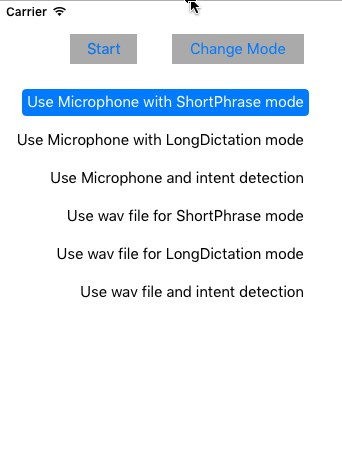

The client library
==================

The Speech To Text client library is a client library for Microsoft Cognitive Services (formerly Project Oxford)
Speech To Text APIs.  

To add the client library dependency from an existing XCode Project:
1. Select your target application, and open the menu "File" then "Add Files to ..."
2. Navigate to Speech \> SpeechToText \> iOS \> iPhoneOS, select "SpeechSDK.framework", and click "Add".
3. Go to your project settings, by single clicking your project, and navigate to the "General" tab.  You'll notice that SpeechSDK.framework exists under the "Linked Frameworks and Libraries" section.
4. In the General tab, under the "Embedded Binaries" section, click the (+) button.   In the dialog, select "SpeechSDK.framework" and click the "Add" button.
5. If you wish to run on the iOS Simulator or MacOSX, repeat steps 2-4 but choose either "iPhoneSimulator" or "MacOSX" instead.

The Speech Recognition Sample
==========

This sample is an iOS application to demonstrate the use of Microsoft Cognitive Services (formerly Project Oxford)
Speech To Text API.

It demonstrates the following features using a wav file or external microphone input:

* Short-form recognition.
* Long-form dictation.
* Recognition with intent.

Build the sample
----------------

1. First, you must obtain a Speech API subscription key by following instructions in [Microsoft Cognitive Services subscription](<https://www.microsoft.com/cognitive-services/en-us/sign-up>).

2.  Start XCode and choose the menu "File", and "Open..." the workspace file Speech \> SpeechToText \> iOS \> SpeechSDK.xcworkspace.

3.  In XCode, select menu "Product \> Build" to build the sample,
    and "Run" to launch this sample app.

Running the sample
--------------

In XCode, select the menu "Product", and "Run" to launch this sample app.

1.  In the application, press the button "Change Mode" to select what type of Speech would like to use.

2.  For modes where you would like both Speech recognition and Intent to work, you need to sign up [Language Understanding Intelligent Service (LUIS)](<https://www.microsoft.com/cognitive-services/en-us/sign-up>) and set the key values in
    luisAppID and luisSubscriptionID from "Samples\_SpeechRecognitionServerExample\_settings.plist".

3. To Start recognition, press the Start button.

Contributing
============
We welcome contributions and are always looking for new SDKs, input, and
suggestions. Feel free to file issues on the repo and we'll address them as we can. You can also learn more about how you can help on the [Contribution
Rules & Guidelines](</CONTRIBUTING.md>).

For questions, feedback, or suggestions about Microsoft Cognitive Services, feel free to reach out to us directly.

-   [Cognitive Services UserVoice Forum](<https://cognitive.uservoice.com>)

License
=======

All Microsoft Cognitive Services SDKs and samples are licensed with the MIT License. For more details, see
[LICENSE](</LICENSE.md>).

Sample images are licensed separately, please refer to [LICENSE-IMAGE](</LICENSE-IMAGE.md>).
