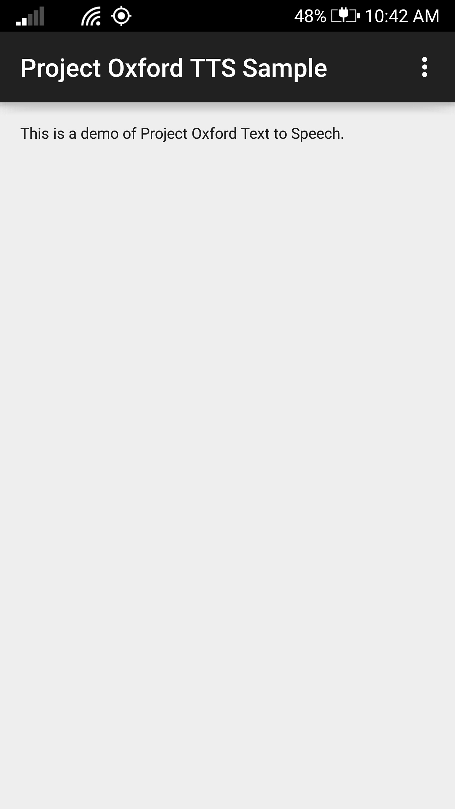

The client library
==================

The Text To Speech client library is a client library for Project Oxford
Text To Speech REST APIs.  

The sample
==========

This sample is an Android application to demonstrate the use of Project Oxford
Text To Speech API.

Requirements
------------

* Android OS must be Android 4.1 or higher (API Level 16 or higher)
* The speech client library contains native code. To use this sample in an emulator, make sure that your build variant matches the architecture (x86 or arm) of your emulator. However, due to the need of audio, using a physical device is recommended.

Build the sample
----------------

1.  You must obtain an [Speech API subscription
    key](<http://www.projectoxford.ai/doc/general/subscription-key-mgmt>) and
    will need a [Microsoft Azure Account](<http://www.azure.com>).

2.  Start Android Studio and open project by File \> Import Project. Choose
    subfolder "Sample" in the Speech \> TextToSpeech \> Android folder.

3.  In Android Studio -\> "Project" panel -\> "Android" view, open file
    "app/res/values/strings.xml", and find the line
    "Please\_add\_the\_subscription\_key\_here;". Replace the
    "Please\_add\_the\_subscription\_key\_here" value with your subscription key
    string from the first step. If you cannot find the file "string.xml", it is
    in folder "Sample\app\src\main\res\values\string.xml".

4.  In Android Studio, select menu "Build \> Make Project" to build the sample,
    and "Run" to launch this sample app.

Run the sample
--------------

In Android Studio, select menu "Run", and "Run app" to launch this sample app.

Contributing
============
We welcome contributions and are always looking for new SDKs, input, and
suggestions. Feel free to file issues on the repo and we'll address them as we can. You can also learn more about how you can help on the [Contribution
Rules & Guidelines](</CONTRIBUTING.md>).

For questions, feedback, or suggestions about Project Oxford services, feel free to reach out to us directly.

-   [Project Oxford support](<mailto:oxfordSup@microsoft.com?subject=Project%20Oxford%20Support>)

-   [Forums](<https://social.msdn.microsoft.com/forums/azure/en-US/home?forum=mlapi>)

-   [Blog](<https://blogs.technet.com/b/machinelearning/archive/tags/project+oxford/default.aspx>)

License
=======

All Project Oxford SDKs and samples are licensed with the MIT License. For more details, see
[LICENSE](</LICENSE.md>).

Sample images are licensed separately, please refer to [LICENSE-IMAGE](</LICENSE-IMAGE.md>).
