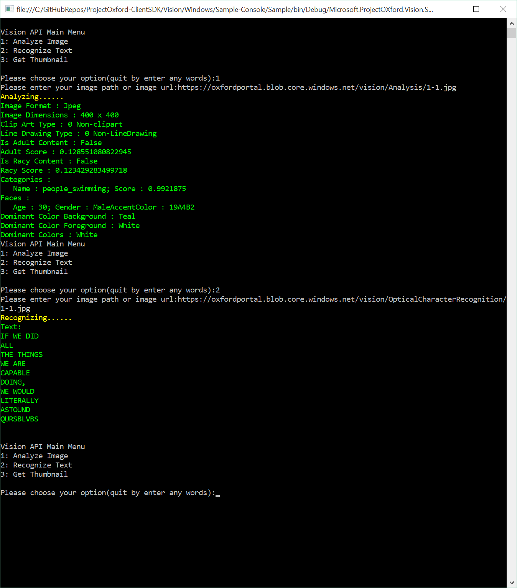

The client library
==================

The Vision API client library is a thin C\# client wrapper for Project Oxford Vision
REST APIs.  

The easiest way to use this client library is to get microsoft.projectoxford.vision package from [nuget](<http://nuget.org>).

Please go to [Vision API Package in nuget](https://www.nuget.org/packages/Microsoft.ProjectOxford.Vision/) for more details.

The sample
==========

This sample is a Windows console application to demonstrate the use of Project
Oxford Vision API.

Build the sample
----------------

1.  Start Microsoft Visual Studio 2015 and select File \> Open \>
    Project/Solution.

2.  Starting in the folder where you clone the repository, go to Vision \> Windows
    \> Sample-Console Folder.

3.  Double-click the Visual Studio 2015 Solution (.sln) file
    VisionAPI-Console-Sample.

4.  Press Ctrl+Shift+B, or select Build \> Build Solution.

Run the sample
--------------

1. First, you will
need a [Microsoft Azure Account](<http://www.azure.com>) if you don't have one already.

2. You must obtain a subscription key for Vision API by following instructions in [Subscription
key management](<http://www.projectoxford.ai/doc/general/subscription-key-mgmt>).

3. Locate the folder where you are going to run the compiled sample. You should be able to find the path in the Output window in Visual Studio after a successful build.

4. In the folder above, find the file with the name of Microsoft.ProjectOXford.Vision.Sample.exe.config.

5. Use a text editor to open the file.

6. Find the text: \<add key="subscriptionKey" value="Please\_add\_the\_subscription\_key\_here"/\>.
Replace "Please\_add\_the\_subscription\_key\_here" with your subscription key.

7. Go back to Visual Studio, and press F5 to run the sample.

The console application will ask for image path or URL to analyze.

Microsoft will receive the images you upload and may use them to improve Vision
API and related services. By submitting an image, you confirm you have consent
from everyone in it.

Contributing
============
We welcome contributions and are always looking for new SDKs, input, and
suggestions. Feel free to file issues on the repo and we'll address them as we can. You can also learn more about how you can help on the [Contribution
Rules & Guidelines](</CONTRIBUTING.md>).

For questions, feedback, or suggestions about Project Oxford services, feel free to reach out to us directly.

-   [Project Oxford support](<mailto:oxfordSup@microsoft.com?subject=Project%20Oxford%20Support>)

-   [Forums](<https://social.msdn.microsoft.com/forums/azure/en-US/home?forum=mlapi>)

-   [Blog](<https://blogs.technet.com/b/machinelearning/archive/tags/project+oxford/default.aspx>)

License
=======

All Project Oxford SDKs and samples are licensed with the MIT License. For more details, see
[LICENSE](</LICENSE.md>).

Sample images are licensed separately, please refer to [LICENSE-IMAGE](</LICENSE-IMAGE.md>).
